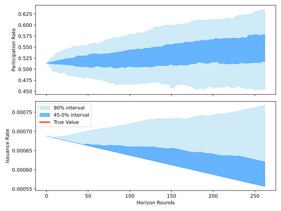
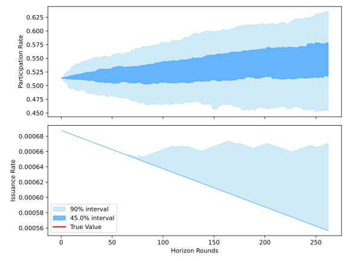
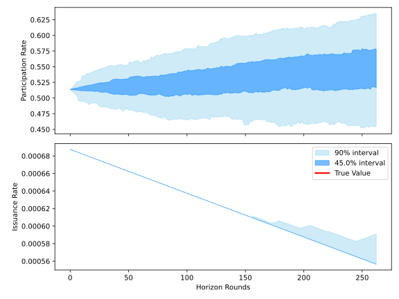

# LPT emissions parameter tuning risk report

[toc]

## Background

### Design of the emissions mechanism

* Livepeer Protocol allows LPT holders to *delegate* their tokens, and associated voting power, to a node operator, a.k.a. Orchestrator. Every round of 6337 Ethereum blocks, new LPT tokens are issued and distributed as **rewards** to Orchestrators, who pass them on to their Delegators after taking a cut.

* The **emissions schedule** — that is, the amount of new LPT issued each round — is controlled by a mechanism that adjusts the rate according to the **bonding rate**, that is, the proportion of LPT supply locked in stake positions. (The bonding rate is also called the *participation rate*.) Specifically, each round the emissions rate is adjusted up, resp. down, by a fixed additive offset, according to whether the bonding rate is below, resp. above, a constant setpoint. 

  The rationale for this mechanism is that higher, resp. lower emissions entail a greater, resp. lesser incentive to stake LPT. In theory, then, the mechanism ought to encourage stake participation to tend towards the setpoint.

* The additive offset and the setpoint are parameters of the mechanism. In the contract source, they are called `inflationChange` and `targetBondingRate`, respectively. They are quantified in units of parts per billion (ppb). More precisely, `targetBondingRate` is expressed in ppb and `inflationChange` is expressed in ppb per round.

* The current settings for these parameters are `500` (0.00005% adjustment per round) and `500_000_000` (50% bonding rate target).

* This mechanism is implemented in the **Minter** contract.

  * Deployment: https://arbiscan.io/address/0xc20DE37170B45774e6CD3d2304017fc962f27252 
  * Source: https://github.com/livepeer/protocol/blob/delta/contracts/token/Minter.sol

### History of changes or proposed changes to emissions mechanism

* The original concept for the participation-based emissions mechanism was published in a [Medium article](https://petkanics.medium.com/inflation-and-participation-in-stake-based-token-protocols-1593688612bf ) by Doug Petkanics in 2017.
* In July 2020, Viktor Bunin introduced a proposal to slow down the `inflationChange` parameter. At the time, emissions appeared to be on a crash course to zero. Since the network was not earning any revenue of note at the time, that would have killed essentially all Orchestrator income. The proposed changes also necessitated changing the units of the `inflationChange` and `inflation` variables from ppm to ppb (per round).
* August 2020, these proposals were finalised as LIP-35 (bundling LIP-34 and LIP-40).
* In February 2022, Livepeer Protocol migrated to Arbitrum One. Since that time, the bonding rate has mostly remained between 40 and 50%. Emissions bottomed out in December 2022 and have risen almost every single round since then.

## Defining risks

The Livepeer emissions system does not have a commonly accepted standard of "failure" or "insolvency" against which to judge risk. Therefore, in addition to studying the possible causes of undesired outcomes, part of our task is to arrive at a definition of which outcomes are undesired.

Key terms are defined in [`/risk/glossary.md`](../risk/glossary.md).

### Objectives

We express the undesired outcomes for bonding rate in terms of the average over each calendar month in H1 2026: six numerical measurements.

* The calendar month bonding rate is not **low** for more than one calendar month in H1 2026.
* The calendar month bonding rate is never **critically low** in H1 2026.
* H1 2026 dilution is within the **dilution bound**.

Grosso modo, the reasoning behind the undesirability of these outcomes revolves around balancing fears of *capital flight* (high dilution) and *low security* (low bonding rate). We do not currently have a framework to quantify the effect of bonding rate on "security" or of dilution on investor confidence; instead, we simply employ these metrics directly to form objectives.

### Horizon

We chose H1 2026 as a horizon for objectives because the error of our forecasts grows too much to be useful beyond that window. The six month window is also the chosen interval for the regular Advisory Board governance process, making it a convenient time to revisit the emissions risk assessments.

### Low bonding rate

The purpose of this report is not to define *why* low bonding rate is an undesired outcome. Nonetheless, a few comments on the topic are possible:

* Resistance to hostile governance actions. Currently, transfers from the treasury are controlled by DAO votes and enforced onchain. A successful hostile governance action could therefore drain the treasury. For context, at time of writing the treasury holds 485,127 LPT, valued at a little over $2M USD.

* Part of the design of the Livepeer protocol calls for staked tokens to be treated as collateral that may be subject to penalty charges (a.k.a. slashing) in the event of improper node behaviour. Under such a design, the TVL of the protocol is often consdered a measure of the "economic security" of the system.

  The slashing component of Livepeer's design is not currently implemented, so stake does not currently contribute any security in this sense. However, the participation rate may be interpreted as a signal of commitment to security in a future where slashing is eventually implemented.

* Low bonding rate may signal a lack of investor interest in LPT-denominated yield, or in Livepeer as a whole. In this case, low bonding rate is merely a symptom of an underlying problem and not a problem in and of itself. Attempting to correct a low bonding rate in this scenario may simply mask the underlying risk factor.

### Non-objectives

For the purposes of this report, we don't regard a *high bonding rate* or *high yield* as a risk outcome. However, since high yield is associated with high dilution, an outcome that satisfies our objectives will naturally also have limited yield.

### Risk scenarios and causes

What could cause our risk criteria to be triggered?

**Extreme emissions outcomes.** The two most extreme possible outcomes for dilution are:

* (Max emissions) `inflation` increases every round from now until July 1st 2026.
* (Min emissions) `inflation` decreases every round from now until July 1st 2026.

The Livepeer Summit simulations assume a minimum emissions outcome.

**Excessive dilution** occurs when `currentBondingRate` spends too much time below `targetBondingRate`. The amount of time it can spend below the target without tripping the dilution criterion depends on the value of `inflationChange`. As a crude approximation, if `inflationChange` is set to a value $x$ and `currentBondingRate` spends a proportion $r$ of rounds below the target, where $r>1/2$, the total dilution is similar to a that of a minimum emissions outcome with `inflationChange` were set to $(2r-1)x$.

**Low bonding rate** occurs when delegators find other opportunities in the market more attractive than LPT staking. This judgement depends on the yield, but also a host of other factors external to the Livepeer system. Ideally, the bonding rate would remain within admissible bounds even when conditions on these exogenous factors are extreme.

A low bonding rate can be *short-lived* (defined here to be less than one month) or *persistent* (longer than one month). These conditions are associated with different causes and, likely, require different solutions.

**Ephemeral low bonding rate** may be due to temporary changes in exogenous variables — in other words, market conditions. Essentially, if other opportunities such as trading beccome more attractive than LPT staking, it may trigger a stake flight. This intuition is supported by both anecdotal and statistical evidence (though we have not subjected the available evidence to causal inference analysis).

*Example.* The bonding rate dips temporarily below the 90 day moving average around the time of Trump's US election victory (which was somewhat anticipated in markets) and does not rise above it again until mid-January (coincidentally, exactly on the launch date of the TRUMP cryptocurrency).


Simple OLS regression against market indicators suggests a negative relationship between bonding rate and market activity, as illustrated by this snippet.

Delegators incur switching costs when moving capital out of LPT stake and deploying it elsewhere. Higher switching costs mean that the delta between the perceived returns to LPT stake versus other opportunities must be larger for investors to decide to switch. Currently, the main cost involved in moving out of LPT stake is the 1 week withdrawal period.

**Persistently low bonding rate** may be due to structural factors such as *lack of interest in Livepeer as a whole* or *barriers to entry to LPT staking.* Addressing these factors may take some time, so it is important that in the meantime the chosen objectives are realistic *within* the constraints they impose.

**Combination risk scenarios.** Because of the design of the emissions mechanism, a *persistently low bonding rate* often results in excessive dilution. However, bonding rate can return to near the target and dilution remain high, so excessive dilution does not necessarily imply low bonding rate.

### Quantifying objectives

Based on results from the community survey, we adopt the following policy for maintaining bonding rate with

* A bonding rate of below 40% (`currentBondingRate < 400_000_000`) is considered **low**.
* A bonding rate of below 30% (`currentBondingRate < 300_000_000`) is considered **critically low**.

It is important to note that the choice of tuning for `targetBondingRate` need not equal either of these thresholds, although the choice of these thresholds will certainly inform the former.

Now suppose that we set our dilution objective to a value $X$. The smallest tuning of `inflationChange` that has a positive chance of achieving $X$ is the value that would achieve $X$ under a minimum emissions outcome. Let's call this the *naïve tuning*. Naïve tunings can be computed without any data, since the evolution of `currentBondingRate` is assumed known a priori.

### Admissible tunings

Given objectives for bonding rate and dilution, a parameter tuning is **risk-admissible** if a model predicts that under those parameters, those objectives will be achieved with probability greater than a given threshold $p\in[0,1]$. Typically, a threshold quite close to $1$ is used. In the sequel, we will use $p=0.95$.

## Simulation model

### Model description

* The *bonding ratio* is defined to be the ratio of staked to unstaked LPT. The bonding ratio can range from $0$ to $\infty$. A bonding ratio of $1$ means that 50% of LPT is staked. The objective threshold of 40% participation rate corresponds to a bonding ratio of $2/3$.
* In technical terms, we are fitting a power model to predict the *per round rate of change of the bonding ratio.* By taking logarithms, this is equivalent to fitting a linear model to the differenced logits of participation rate. 
* We estimate parameters (that is, *train*) the linear model using ridge regression.
* The model was trained and validated on data from 2022-07-01 to 2025-11-20. We do not use any data more recent than November 20th 2025.
* Model parameters are estimated using ridge regression on a window of training data. 
* We select from among subsets of features using our professional judgement and AIC.
* We trained the model on multiple randomly selected folds from the training data in order to assess robustness of parameter estimates. We found that apart from the AR(1) coefficient, which behaved anomalously in some folds, parameter estimates remained stable across folds.
* Key features: 
  * Lagged bonding rate (AR(1) factor).
  * Annualised yield rate.
  * CoinMarketCap 
  * Annualised weekly volatility of ETH daily returns.

### Simulation methodology

For each tuning, we check risk admissibility by using Monte Carlo sampling (200 runs) to estimate the probability of achieving the emissions objective (OE) and the bonding rate objective (OB). A tuning is considered risk admissible if, for each of the two objectives, the estimated success probability is at least $0.95$.

We iterate through objective choices and parameter tunings using the following algorithm:

1. We fix a list of values to try as dilution objectives for H1 2026. Expressed as percentages, the list we used is `[12, 11.5, 11, 10.5]`.
2. For each candidate dilution objectives, we iterate through parameter tunings, testing each for risk admissibility, as follows:
   1. First set `targetBondingRate` to a low value such as 30%. A value is considered "low" if, under all tunings we considered, bonding rate is very unlikely to fall below this figure at all during the forecast interval.
   2. Now start at `inflationChange = 500` and adjust in increments of `100` until a risk admissible tuning is found. This tuning for `inflationChange` is called the *naive optimum*. It is the smallest value of `inflationChange` that can possibly achieve the objective.
   3. Next, increase `targetBondingRate` in increments of 1% until a tuning is found that is *not* risk admissible. The previous iteration — the most recently tested tuning that was found to be admissible — is Pareto efficient.
   4. Again, increase `inflationChange` in increments of `100` until an admissible tuning is found.
   5. Repeat steps (3) and (4) until `inflationChange` reaches 1500, then stop.

### Simulation results

The bonding rate objective was achieved with high confidence under all parameter tunings we considered. That is, every parameter tuning is risk admissible with respect to (OB).

The sets of admissible tunings for various choices of value for the (OE) objective are displayed in the following Pareto frontier plot:


## Processes for ongoing maintenance

All sources of uncertainty associated with these forecasts increase with time. In order to remain robust over time and continue to achieve objectives with high confidence, a protocol for ongoing monitoring, parameter updates, and incident response must be developed and followed.

1. What are the possible elements of a risk-managed parameter setting framework for Livepeer issuance?

   **Answer.** Elements are *monitoring*, *trigger and scheduled events,* *interventions*, *review*, and *research*.

2. What are the main tradeoffs between various choices for those elements?

3. What has to happen next in order to get a framework like that fleshed out and operational?

### Monitoring

The community should develop infrastructure for continuous monitoring of the following metrics:

* Bonding rate + rolling averages thereof
* Trailing net dilution rate
* Quarterly, semiannual, or annual dilution forecasts.
* Annualized current yield, emissions, dilution.
* Exogenous signals known to have an influence on participation rate.

It may also benefit the community to have access to an application frontend displaying these data in a user-friendly setting and allowing them to explore forecast assumptions via UI widgets.

### Events

Metrics that cross tolerance thresholds such as 40% bonding rate should trigger an alert. Depending on the severity of the condition, the response to the alert can progress through the following four tiers.

1. Heightened monitoring.

   This can take the form of more regular, thorough reporting of metrics to the community and rerunning forecasts on fresh data (which is relatively cheap).

2. Community forum.

   Float the system state in a designated forum, such as the Livepeer Forum or the weekly Water Cooler Chat, for community members to voice their views on proximate causes of the scenario and whether further intervention is warranted.

3. Objective review.

   Revisit the community to see if objectives can be revised given the new information. Under revised objectives, the community may ultimately find the new situation tolerable. Or, the new objectives may permit fresh parameter tunings.

4. Intervention.

   Discussed below.

The tuning should also be revisited on a regular calendar, regardless if any risk events trigger an early review. Based on the estimated precision of our current forecasting models, we recommend these reviews take place at least once every six months.

### Interventions

The nature of appropriate interventions depend on whether the problem is thought to be *ephemeral* or *persistent*.

**Ephemeral low bonding rate.**

In trigger states thought to be ephemeral, the ideal response may be to do nothing and wait for the situation to resolve itself.

If the trigger state is considered severe enough to warrant urgent intervention, the following options present themselves:

1. *Stimulus.* Introduce aggressive, short-lived subsidies to stake. (Such subsidies are also sometimes called simply "incentives" or "incentive programmes.") The stimulus approach can also be automated with a suitable emission controller design.
2. *Staker of last resort.* A designated entity steps in to stake LPT in order to keep participation rate above some threshold. Naturally, this introduces a centralisation concern, but may at least serve as a temporary defence against hostile governance actions and shore up confidence during a crisis.

**Persistent low bonding rate.**

The only conceivable intervention is to investigate possible structural causes for the condition and try to address them.

* Improved communication, messaging campaigns
* Improved UX

**Excessive emissions.**

Excessive emissions can be prevented *a priori* with a hard cap. However, the community may prefer to allow emissions to rise to a high level temporarily as a stimulus to mitigate an ephemeral low bonding rate, and instead manually control for quarterly, semiannual, or annual emissions targets.

* *Ephemeral case*. Do nothing. Ephemeral high emissions can be used as a deliberate stimulus to correct an ephemeral low bonding rate.
* Revise emission control parameters.

### Objective and parameter tuning review process

A process for revisiting the tuning looks as follows:

1. Engage the community to revise objective figures and update if necessary.
2. Run the latest forecast models on the newest historical data, assuming parameters stay the same.
3. If current parameter settings are risk admissible, release a report to the community and do nothing.
4. If current parameter settings are not risk admissible, run simulation model on nearby parameter settings and map out the frontier of admissible values.
5. Proposal authors may need to consult the community again to choose from among tunings on the Pareto frontier.

### Research directions

To pre-empt the threat of persistently excessive emissions

* More detailed strategy and objective framework for emissions control, including budget categories.
* Identify structural factors limiting participation.
* Attempt to quantify effect of dilution on investor confidence.
  * Compare with other protocols
  * Fieldwork
* Develop control mechanisms with better UX, stability, and boundedness properties.
  * Ideal control mechanism would require fewer interventions (parameter updates) and enable forecasting the controlled parameters further into the future with greater confidence.
* Build better forecasting models:
  * Use more information, e.g. breakdowns of stake movements
  * More robust model selection or weighting procedure
  * Adaptive dynamic parameters

## Appendix

### Fan plots

To illustrate the effects of various tunings of the `targetBondingRate` parameter, we show p95 dilution and fan plots of forecast emission and bonding rates over H1 2026.

* Visually, there is very little difference between the evolutions of participation rate under the different tunings. That reflects the fact that our models cannot detect a large effect of emissions rate on participation.
* Adjusting the `inflationChange` parameter yields fans that look visually identical, but for which the y-axis on the emissions rate chart is scaled. For that reason, we haven't included images of the fan plots under tunings with higher `inflationChange`.
* There is a critical value of `targetBondingRate` above which increasing `inflationChange` makes p95 emissions higher instead of lower. We didn't try to compute this figure accurately, but it appears to be between 47 and 48%.
* With `targetBondingRate` set at 45%, the uncertainty about dilution over H1 2026 is low, as can be seen from the fan plots.

```
targetBondingRate	|	inflationChange	|	dilution_p95 (%)
450_000_000			|	 500			|	11.8
450_000_000			|	 700			|	11.3
450_000_000			|	1000			|	10.5
450_000_000			|	1500			|	 9.1
470_000_000			|	 500			|	12.5
470_000_000			|	 700			|	12.3
470_000_000			|	1000			|	12.0
470_000_000			|	1500			|	11.4
500_000_000			|	 500			|	13.7
500_000_000			|	 700			|	14.0
500_000_000			|	1000			|	14.4
500_000_000			|	1500			|	15.0
```





### Admissible tunings

The following table lists Pareto optimal tunings that achieve given dilution objectives with high confidence. These data points are used to plot the Pareto front shown in [Simulation results](#simulation-results).

| Dilution objective | `targetBondingRate` (%) | `inflationChange` |
| ------------------ | ----------------------- | ----------------- |
| **12%**            | 45                      | 500               |
|                    | 46                      | 700               |
|                    | 47                      | 1000              |
| **11.5%**          | 44                      | 600               |
|                    | 45                      | 700               |
|                    | 46                      | 1000              |
|                    | 47                      | 1500              |
| **11%**            | 45                      | 800               |
|                    | 46                      | 1300              |
